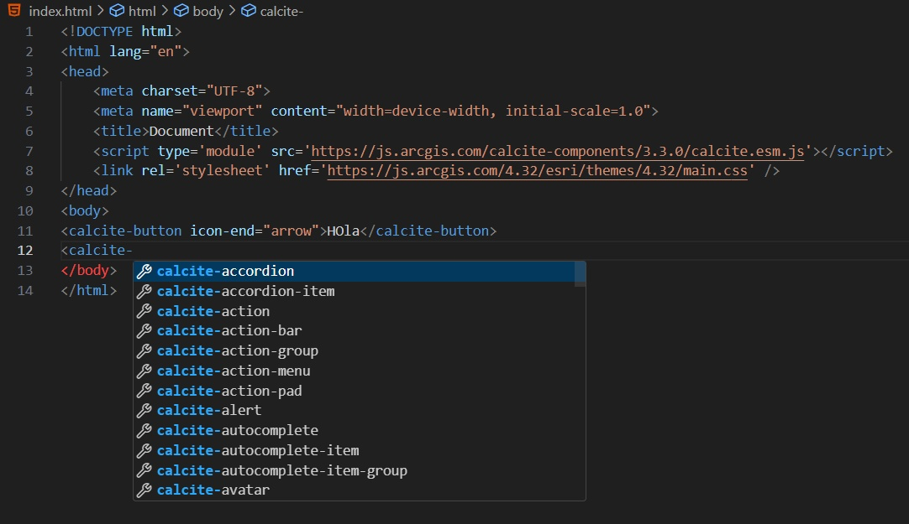
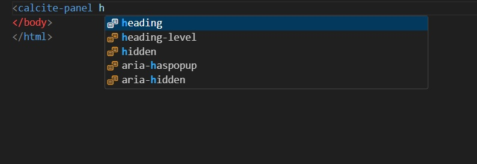
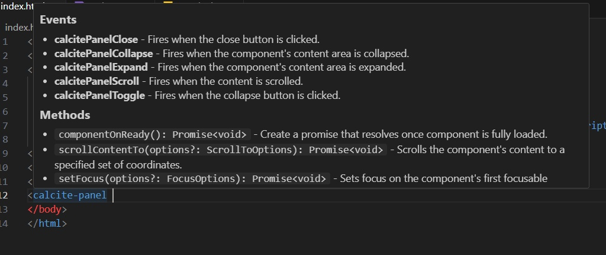

# Calcite IntelliSense (Custom HTML Data)

Injects HTML IntelliSense (completion, hover, documentation) for **Esri Calcite Design System** web components, using Esri’s official custom-data JSON.

## Features

*   Tag and attribute completion for Calcite components
*   Hover documentation (descriptions, attribute value hints)
*   Works in HTML and common web contexts (`.html`, `.ts/.tsx`, `.js/.jsx`, including template strings)

## Requirements

*   **VS Code** ≥ 1.93

## Usage

Start typing any Calcite component tag (e.g., `<calcite-accordion ...>`) or an attribute (e.g., `scale="m"`) and IntelliSense will suggest options derived from the custom-data JSON.

_Usage Example Panel_  

_Usage Example Panel attribute_

_Usage Panel Documentation_

Official components documentation: [Components | Calcite Design System | Esri Developer](https://developers.arcgis.com/calcite-design-system/components/)

---

## Supported Components

Total: 113

*   calcite-accordion
*   calcite-accordion-item
*   calcite-action
*   calcite-action-bar
*   calcite-action-group
*   calcite-action-menu
*   calcite-action-pad
*   calcite-alert
*   calcite-autocomplete
*   calcite-autocomplete-item
*   calcite-autocomplete-item-group
*   calcite-avatar
*   calcite-block
*   calcite-block-group
*   calcite-block-section
*   calcite-button
*   calcite-card
*   calcite-card-group
*   calcite-carousel
*   calcite-carousel-item
*   calcite-checkbox
*   calcite-chip
*   calcite-chip-group
*   calcite-color-picker
*   calcite-color-picker-hex-input
*   calcite-color-picker-swatch
*   calcite-combobox
*   calcite-combobox-item
*   calcite-combobox-item-group
*   calcite-date-picker
*   calcite-date-picker-day
*   calcite-date-picker-month
*   calcite-date-picker-month-header
*   calcite-dialog
*   calcite-dropdown
*   calcite-dropdown-group
*   calcite-dropdown-item
*   calcite-fab
*   calcite-filter
*   calcite-flow
*   calcite-flow-item
*   calcite-graph
*   calcite-handle
*   calcite-icon
*   calcite-inline-editable
*   calcite-input
*   calcite-input-date-picker
*   calcite-input-message
*   calcite-input-number
*   calcite-input-text
*   calcite-input-time-picker
*   calcite-input-time-zone
*   calcite-label
*   calcite-link
*   calcite-list
*   calcite-list-item
*   calcite-list-item-group
*   calcite-loader
*   calcite-menu
*   calcite-menu-item
*   calcite-meter
*   calcite-modal
*   calcite-navigation
*   calcite-navigation-logo
*   calcite-navigation-user
*   calcite-notice
*   calcite-option
*   calcite-option-group
*   calcite-pagination
*   calcite-panel
*   calcite-popover
*   calcite-progress
*   calcite-radio-button
*   calcite-radio-button-group
*   calcite-rating
*   calcite-scrim
*   calcite-segmented-control
*   calcite-segmented-control-item
*   calcite-select
*   calcite-sheet
*   calcite-shell
*   calcite-shell-center-row
*   calcite-shell-panel
*   calcite-slider
*   calcite-sort-handle
*   calcite-sortable-list
*   calcite-split-button
*   calcite-stack
*   calcite-stepper
*   calcite-stepper-item
*   calcite-swatch
*   calcite-swatch-group
*   calcite-switch
*   calcite-tab
*   calcite-tab-nav
*   calcite-tab-title
*   calcite-table
*   calcite-table-cell
*   calcite-table-header
*   calcite-table-row
*   calcite-tabs
*   calcite-text-area
*   calcite-tile
*   calcite-tile-group
*   calcite-tile-select
*   calcite-tile-select-group
*   calcite-time-picker
*   calcite-tip
*   calcite-tip-group
*   calcite-tip-manager
*   calcite-tooltip
*   calcite-tree
*   calcite-tree-item

## Issues & Feedback

If you find a bug or have a suggestion, please open an issue on the [GitHub repository](https://github.com/KaronteDev/calcite-intellisense-vscode/issues).

## License

### **MIT License**

_Copyright (c) 2025 Karonte Dev_

Permission is hereby granted, free of charge, to any person obtaining a copy  
of this software and associated documentation files (the "Software"), to deal  
in the Software without restriction, including without limitation the rights  
to use, copy, modify, merge, publish, distribute, sublicense, and/or sell  
copies of the Software, and to permit persons to whom the Software is  
furnished to do so, subject to the following conditions:

The above copyright notice and this permission notice shall be included in all  
copies or substantial portions of the Software.

THE SOFTWARE IS PROVIDED "AS IS", WITHOUT WARRANTY OF ANY KIND, EXPRESS OR  
IMPLIED, INCLUDING BUT NOT LIMITED TO THE WARRANTIES OF MERCHANTABILITY,  
FITNESS FOR A PARTICULAR PURPOSE AND NONINFRINGEMENT. IN NO EVENT SHALL THE  
AUTHORS OR COPYRIGHT HOLDERS BE LIABLE FOR ANY CLAIM, DAMAGES OR OTHER  
LIABILITY, WHETHER IN AN ACTION OF CONTRACT, TORT OR OTHERWISE, ARISING FROM,  
OUT OF OR IN CONNECTION WITH THE SOFTWARE OR THE USE OR OTHER DEALINGS IN THE  
SOFTWARE.

© 2025 K-dev. Not affiliated with Esri. All Calcite Design System trademarks belong to their respective owners.